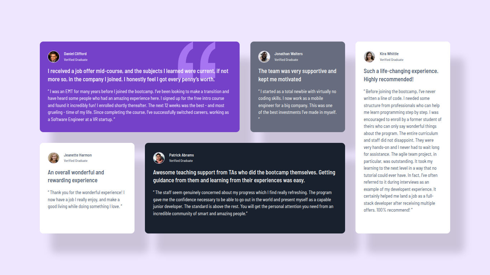

# Frontend Mentor - Testimonials grid section solution

This is a solution to the [Testimonials grid section challenge on Frontend Mentor](https://www.frontendmentor.io/challenges/testimonials-grid-section-Nnw6J7Un7). Frontend Mentor challenges help you improve your coding skills by building realistic projects.

## Table of contents

- [Overview](#overview)
  - [The challenge](#the-challenge)
  - [Screenshot](#screenshot)
  - [Links](#links)
- [My process](#my-process)
  - [Built with](#built-with)
  - [What I learned](#what-i-learned)
  - [Continued development](#continued-development)
- [Author](#author)

## Overview

### The challenge

Users should be able to:

- View the optimal layout for the site depending on their device's screen size

### Screenshot

### Links

- Solution URL: [Github repo URL](https://github.com/frontend-rustyff12/07-fm-testimonials-grid-section)
- Live Site URL: [Live site URL](https://testimonials-grid-section-rustyff12.netlify.app/)

## My process

### Built with

- Semantic HTML5 markup
- CSS custom tailwind properties
- CSS Grid
- Mobile-first workflow
- Tailwind CSS
- [React](https://reactjs.org/) - JS library

### What I learned

Good preactice for responsive layouts. I learned about positioning background images in tailwind

### Continued development

Would be good as an example for a future component as part of a bigger project

## Author

- Frontend Mentor - [@rustyff12](https://www.frontendmentor.io/profile/rustyff12)
